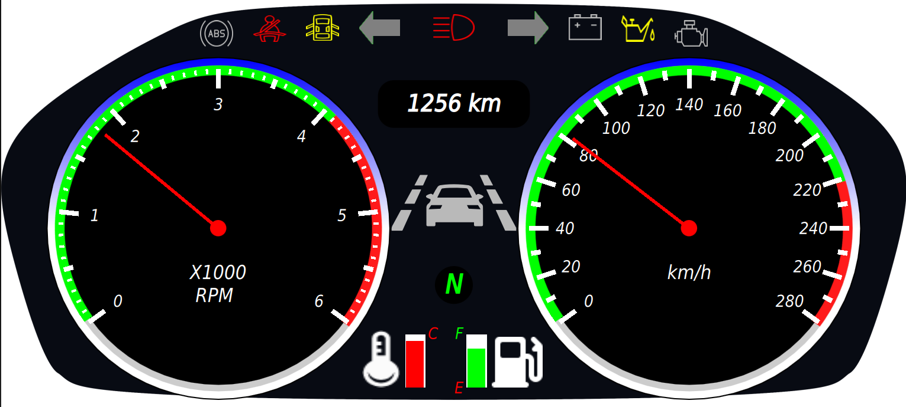

# Car Dashboard with SOME/IP Integration

## Overview

This project implements a car dashboard system that communicates with various services using the SOME/IP (Scalable Service-Oriented MiddlewarE over IP) protocol. The dashboard acts as a client, interacting with services such as speed, fuel level, and temperature etc.

## Features

- **Speed Display:** Real-time display of the vehicle's speed obtained from the speed service.
- **Fuel Level Indicator:** Visual representation of the current fuel level retrieved from the fuel service.
- **Temperature Gauge:** Display of the engine temperature obtained from the temperature service.
- **SOME/IP Integration:** Utilizes the SOME/IP protocol for communication with various vehicle services.

## Requirements

- **Hardware:** The dashboard system should be compatible with the vehicle's network architecture and capable of connecting to the SOME/IP network.
- **Software:** Ensure that the necessary libraries and dependencies for SOME/IP communication are installed on the dashboard system[SOME/IP](https://github.com/COVESA/vsomeip).

## Configuration

- **Service Configuration:** Modify the configuration files to specify the IP addresses, ports, and other settings required to connect to the various services.
- **Dashboard Layout:** Customize the dashboard layout and design according to the vehicle's requirements and user preferences.

## License

This project is licensed under the [Mozilla Public License
Version 2.0].

## Acknowledgements

- [SOME/IP](https://github.com/COVESA/vsomeip)
  
